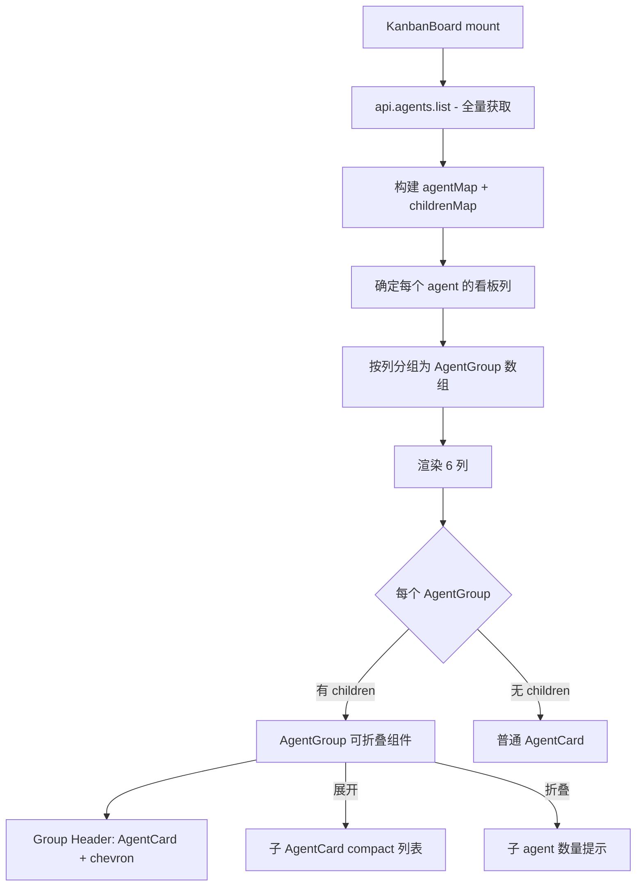

## 产品概述

在 Kanban Board 页面中，将同一个父 agent 派发的子 agent 进行分组合并展示，让用户能直观看出哪些 subagent 属于同一个父 agent。

## 核心功能

- **按父 agent 分组**：同一 parent_agent_id 的 subagent 在看板中归为一组
- **列归属跟随父 agent**：subagent 始终显示在父 agent 所在的 status 列中，不受自身 status 影响
- **可折叠卡片组**：父 agent 作为 group header，点击可展开/收起子 agent 列表
- **子 agent 真实状态标注**：展开后的 subagent 仍显示自身真实 status badge（纯视觉信息，不影响列归属）
- **自动展开活跃组**：有 working/connected 状态子 agent 的组自动展开
- **孤立 subagent 兜底**：找不到父 agent 的 subagent 仍按自身 status 独立展示

## 技术栈

- React + TypeScript (现有)
- Tailwind CSS (现有)
- lucide-react 图标库 (现有)

## 实现方案

### 数据获取变更

当前 KanbanBoard 对 6 个 status 列分别请求 `api.agents.list({ status })`。由于 subagent 需要跟随 parent 列，必须一次获取全部 agent 再在客户端分组。

改为单次调用 `api.agents.list({ limit: 10000 })`，获取全量 agent 后在客户端构建父子关系映射。

### 客户端分组算法

```
1. 遍历全量 agents，构建 Map<parent_agent_id, Agent[]> (childrenMap)
2. 同时构建 Map<agent_id, Agent> (agentMap)，用于快速查找 parent
3. 确定每个 agent 的"看板列":
   - parent_agent_id === null (main agent) → 自身 status 列
   - 有 parent 且 parent 在 agentMap 中 → parent.status 列
   - 无 parent 或 parent 不在数据中(孤立) → 自身 status 列
4. 按列聚合: Map<AgentStatus, AgentGroup[]>
   - AgentGroup = { root: Agent (main/孤立sub), children: Agent[] }
```

### 渲染结构

每个 status 列内渲染 AgentGroup 列表（取代当前的扁平 AgentCard 列表）：

- **Group Header**：父 agent 的 AgentCard，左侧带展开/收起 chevron 按钮
- **折叠时**：显示子 agent 数量提示（如 "3 subagents (2 active)"）
- **展开时**：子 agent 以 compact 模式渲染，缩进 + 左侧紫色竖线连接（复用 Dashboard.tsx 的 `border-l-2 border-violet-500/20` 模式）

### 列计数更新

列头 badge 改为显示"组数"而非"agent 总数"，因为一个组可能包含多个 agent。

### 自动展开逻辑

参照 Dashboard.tsx 的现有模式：检测子 agent 中是否有 working/connected 状态，有则自动展开该组。

### 分页调整

"Show more" 按钮的分页单位从"单个 agent"改为"组"（AgentGroup），避免展开后组内子 agent 被截断。

## 实现注意事项

- **性能**：全量 agent 一次获取 + 客户端分组，O(n) 复杂度，对现有数据量（通常 < 1000 agents）无性能问题
- **向后兼容**：无 subagent 的 main agent 渲染为普通 AgentCard（无折叠按钮），视觉与当前完全一致
- **WebSocket 实时更新**：保持现有 eventBus 订阅不变，`agent_created`/`agent_updated` 触发全量 reload
- **不加新 API 调用**：服务端无需改动，复用现有 `GET /api/agents` 接口

## 架构设计



## 目录结构

```
client/src/
├── components/
│   ├── AgentCard.tsx            # [MODIFY] 新增 compact prop，紧凑模式下减少 padding/隐藏部分信息
│   └── __tests__/
│       └── AgentCard.test.tsx   # [MODIFY] 新增 compact 模式测试用例
└── pages/
    └── KanbanBoard.tsx          # [MODIFY] 核心改动：数据获取改为全量、父子分组逻辑、AgentGroup 渲染
```

## 关键代码结构

### AgentCard 新增 prop

```typescript
interface AgentCardProps {
  agent: Agent;
  onClick?: () => void;
  hideStatus?: boolean;
  compact?: boolean;  // [NEW] 紧凑模式：用于 group 内子 agent 卡片
  showSubStatus?: boolean;  // [NEW] 独立于 hideStatus，在 compact 模式下显示真实 status
}
```

### AgentGroup 数据结构（KanbanBoard 内部）

```typescript
interface AgentGroup {
  root: Agent;         // 主 agent（或孤立 subagent）
  children: Agent[];   // 该主 agent 派发的所有 subagent
}
```

## 设计风格

延续现有项目暗色主题风格，在 Kanban 列内新增父子分组视觉层级。使用紫色系（`violet-500/20`）作为子 agent 关联线的品牌色，与项目中 SessionDetail 和 Dashboard 的父子关系视觉风格保持一致。

## 页面布局设计

### 列内分组结构

- **Group Header 区域**：左侧 chevron 展开按钮（12x12）+ 右侧为现有 AgentCard 样式（不修改）
- **展开区域**：`ml-6 mt-1` 缩进，左侧 `border-l-2 border-violet-500/20 pl-3` 竖线连接
- **折叠提示**：Group Header 下方，`ml-7` 缩进，`text-[11px] text-violet-400` 显示子 agent 数量

### Compact 子 AgentCard

- 减少垂直 padding（`p-2.5` 替代 `p-4`）
- 隐藏 tags 区域（platform/token 标签）
- 隐藏 last_event_summary 区域
- 底部仅保留 status badge + 运行时长
- 左侧图标改为更小的 `w-5 h-5 rounded`
- 增加 subagent 实际 status badge 显示（右上角）

### 自动展开动画

展开/收起使用 CSS `max-height` 过渡 + `overflow-hidden`，配合 `animate-fade-in` 保持一致性

## Agent Extensions

### SubAgent

- **code-explorer**
- Purpose: 在实现过程中快速探索项目中的现有模式和约定
- Expected outcome: 确认 Dashboard/SessionDetail 中父子分组的 UI 代码细节，确保新实现与现有风格一致